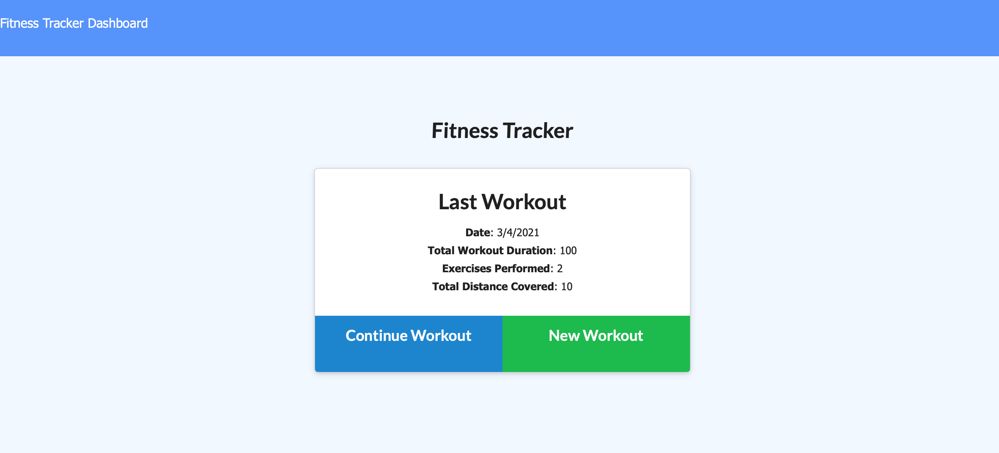

# Workout Tracker

This application offers a workout tracker that allows users to enter excersizes they conduct over time. The tracker aggregates information from the workouts and displays that on a dashboard.

## Installation/Usage

To view the application simply navigate to https://radiant-beyond-38440.herokuapp.com/ in your web browser.

## Technologies

This application uses HTML and CSS for the front end. For the back end, it uses JavaScript, MongoDB, mongoose and express for the back end. The deployed application also uses MongoAtlas for its database.
